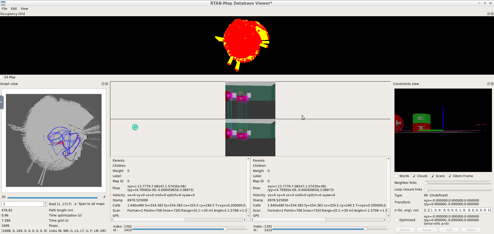

# RoboND-P5-Map-My-World
Project 5 of Udacity Robotics Software Engineer Nanodegree Program

# rtapmapdb location
https://1drv.ms/u/s!An74al5F54mqgTH_C9V2TbPBVgPq?e=EudKWK

## Overview  
A demonstration of a robot using the Real-Time Appearance-Based Mapping (RTB-Map) algorithm to perform simultaneous localization and mapping (SLAM) within an unknown environment. A simple two-wheeled robot uses an RGB-D camera and laser rangefinder sensor to build a map of its surroundings as it drives around. The robot is built using the ROS framework and simulated using the Gazebo simulator.

RTAB-Map (Real-Time Appearance-Based Mapping) is a popular solution for SLAM to develop robots that can map environments in 3D. RTAB-Map has good speed and memory management, and it provides custom developed tools for information analysis. Most importantly, the quality of the documentation on ROS Wiki (http://wiki.ros.org/rtabmap_ros) is very high. Being able to leverage RTAB-Map with your own robots will lead to a solid foundation for mapping and localization well beyond this Nanodegree program.

For this project we will be using the rtabmap_ros package, which is a ROS wrapper (API) for interacting with RTAB-Map. Keep this in mind when looking at the relative documentation.  
* Develop package to interface with the rtabmap_ros package. 
* Localization project to make the necessary changes to interface the robot with RTAB-Map. An example of this is the addition of an RGB-D camera. 
* Generate the appropriate launch files to launch the robot and map its surrounding environment.
* When your robot is launched you will teleop around the room to generate a proper map of the environment.

## Display - rtab_map DatabaseViewer  
 
 

## Prerequisites/Dependencies  
```
sudo apt-get install ros-kinetic-navigation
```
* ROS map_server package  
```
sudo apt-get install ros-kinetic-map-server
```
* ROS move_base package  
```
sudo apt-get install ros-kinetic-move-base
```
* ROS amcl package  
```
sudo apt-get install ros-kinetic-amcl
```
## Run the project  
* Clone this repository
```
https://github.com/tdwilhelm/RoboND-P5-Map-My-World.git
```
* Open the repository and make  
```
cd /home/workspace/RoboND-P5-Map-My-World/catkin_ws/
catkin_make
```
* Launch my_robot in Gazebo to load both the world and plugins  
```
roslaunch my_robot world.launch
```  
* Launch teleop_twist_keyboard node, open a new terminal, enter  
```
cd /home/workspace/RoboND-P5-Map-My-World/catkin_ws/
source devel/setup.bash
rosrun teleop_twist_keyboard teleop_twist_keyboard.py
```  
* Launch teleop_twist_keyboard node, open a new terminal, enter  
```
cd /home/workspace/RoboND-P5-Map-My-World/catkin_ws/
source devel/setup.bash
roslaunch my_robot mapping.launch
```  
* Testing  
Send move command via teleop package to control your robot and observe real-time visualization in the environment `rtabmapviz`.  
rtabmap-databaseViewer ~/.ros/rtabmap.db

* View database
Once you statisfied with your move, press `Ctrl + c` to exit then view your database with
```
rtabmap-databaseViewer ~/.ros/rtabmap.db
```
Remember to rename your `~/.ros/rtabmap.db` before your next attempt since it will be deleted due to the launch file setting in `mapping.launch`
